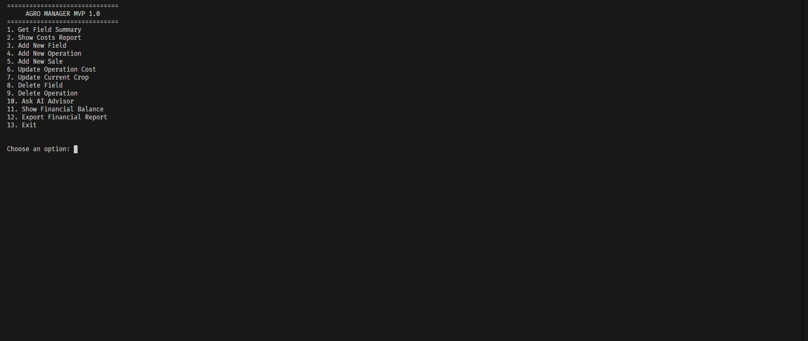
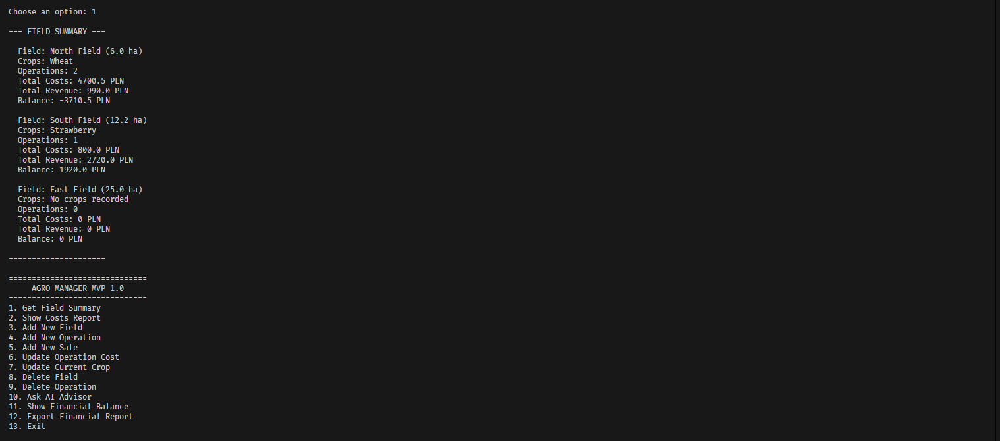
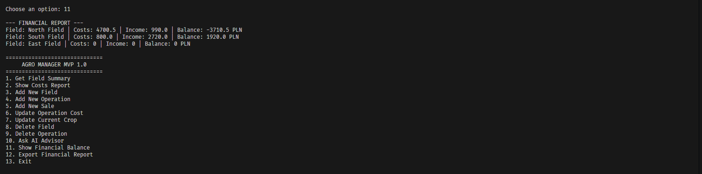
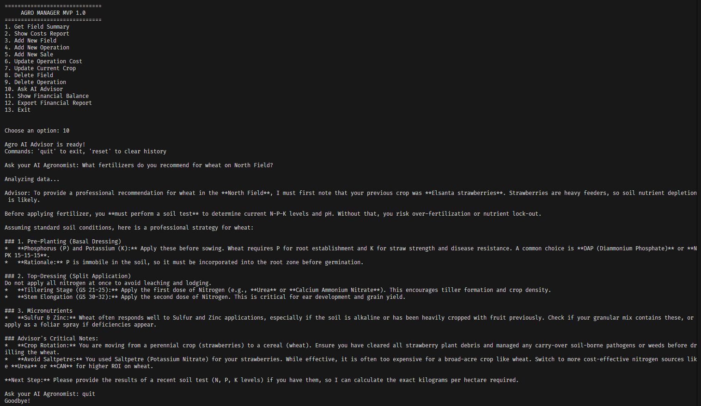

#  Agro Manager MVP

A terminal-based farm management system for tracking field operations, costs, and revenues — with a built-in AI Agronomist Advisor powered by Google Gemini.

---

##  Screenshots

### Main Menu


### Field Summary


### Financial Report


### AI Advisor in action

---

##  Features

- **Field Management** — Add, view, and delete fields with area data
- **Operation Logging** — Record tasks, descriptions, dates, and costs
- **Sales Tracking** — Log crop sales and revenues per field
- **Financial Reports** — Automatic balance calculation (revenue - costs)
- **CSV Export** — One-click export to Excel-ready `.csv` file
- **AI Agronomist Advisor** — Ask farming questions, AI answers using your real farm data
- **Persistent Chat History** — AI remembers your previous questions between sessions

---

##  Tech Stack

| Tool | Purpose |
|---|---|
| Python 3.x | Core language |
| SQLite3 | Local database |
| Google Gemini API | AI Advisor engine |
| pytest + pytest-mock | Unit testing |
| python-dotenv | Environment variable management |

---

##  Getting Started

### 1. Clone the repository
```bash
git clone https://github.com/wojciechsierota/Agro-Manager-MVP.git
cd Agro-Manager-MVP
```

### 2. Install dependencies
```bash
pip install -r requirements.txt
```

### 3. Set up your API key

Create a `.env` file in the root folder:
```
GEMINI_API_KEY=your_api_key_here
```
Get your free API key at: https://aistudio.google.com

### 4. Set up the database
```bash
python database_setup.py
```

### 4.5 Load sample data (optional)
```bash
python seed_data.py
```

### 5. Run the app
```bash
python main.py
```

##  Running Tests
```bash
pytest tests/
```

##  Project Structure
```
agro-manager/
├── main.py               # Entry point, main menu
├── reports.py            # CRUD operations, financial logic, CSV export
├── ai_advisor.py         # Google Gemini AI integration
├── database_manager.py   # DatabaseManager class (OOP)
├── database_setup.py     # Database initialization
├── seed_data.py          # Sample data for testing
├── tests/
│   ├── test_reports.py
│   └── test_ai_advisor.py
├── .env.example          # API key template
├── requirements.txt
└── README.md
```

---

##  AI Advisor Commands

| Command | Action |
|---------|--------|
| *Any question* | Ask your AI agronomist |
| `reset`| Clear conversation history |
| `quit` | Return to main menu |

---

##  Database Schema

**Fields** — `field_id`, `name`, `area_ha`  
**Operations** — `operation_id`, `field_id`, `task_name`, `description`, `date`, `cost`  
**Sales** — `sale_id`, `field_id`, `crop_name`, `quantity_tons`, `total_revenue`, `date`